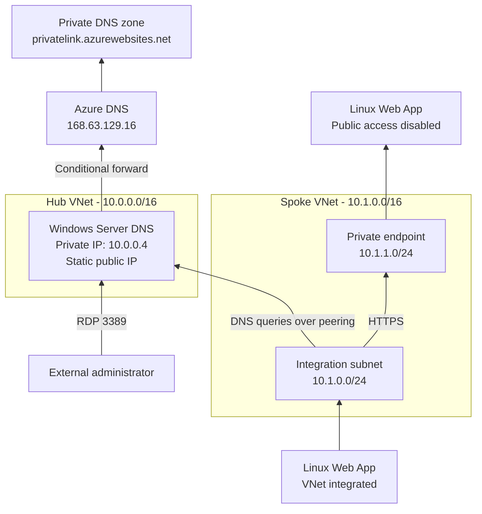

# Hub-Spoke Web Apps with a Custom DNS
This Terraform template creates a hub-and-spoke network with a Windows Server DNS in the hub and two Linux Web Apps in the same spoke. One app uses regional VNet integration, and the other has public access disabled and is exposed through a private endpoint.

## Architecture


- **Hub VNet** (`10.0.0.0/16`) hosts the Windows Server DNS VM at `10.0.0.4`.
- **Spoke VNet** (`10.1.0.0/16`) uses `10.0.0.4` as its DNS server and contains the Web App integration and private endpoint subnets.
- Windows DNS forwards normal queries and conditionally forwards `privatelink.azurewebsites.net` to Azure DNS at `168.63.129.16`.
- The private DNS zone is linked only to the hub VNet, so private endpoint resolution from the spoke follows the custom DNS path.

## Resources created
| File | Resources |
| --- | --- |
| [main.tf](main.tf) | Provider configuration, resource group |
| [networking.tf](networking.tf) | Hub and spoke VNets, three subnets, and VNet peerings |
| [dns.tf](dns.tf) | Static public IP and NIC, Windows Server 2022 VM, and DNS configuration extension |
| [scripts/configure-dns.ps1](scripts/configure-dns.ps1) | PowerShell script for DNS configuration |
| [webapps.tf](webapps.tf) | Linux plan, two Web Apps, private endpoint, and Private DNS zone |
| [variables.tf](variables.tf) | Names, region, VM size/IP, and App Service SKU inputs |
| [outputs.tf](outputs.tf) | DNS details, app hostnames, endpoint IP, and VM credentials |

## Prerequisites
- Terraform 1.5 or later
- Azure CLI authenticated with `az login`
- Permission to create networking, compute, Private DNS, and App Service resources

## Usage
```powershell
# Deployment
terraform init
terraform plan -out main.tfplan
terraform apply main.tfplan
```

Get the generated VM credential when needed:

```powershell
terraform output dns_vm_admin_username
terraform output -raw dns_vm_admin_password
terraform output -raw dns_server_public_ip
```

Use the public IP with an RDP client to connect to the VM. The password is sensitive but is stored in Terraform state. Secure the state with access controls and encryption.

## Verify DNS

After deployment, open the Kudu console for the VNet-integrated app and resolve the private app hostname shown by `terraform output private_web_app_hostname`:

```bash
nslookup app-private-xxxxxx.azurewebsites.net 10.0.0.4
curl -I https://app-private-xxxxxx.azurewebsites.net
```

The lookup should follow a CNAME under `privatelink.azurewebsites.net` and return the `private_endpoint_ip` output. The HTTPS request should reach the private app through its endpoint.

If you're using a Windows Web App, make sure to use the `nameresolver` command when using custom DNS.

## Notes

- The DNS VM has a static Standard public IP for easier troubleshooting and accesibility. For production, prefer Azure Bastion, VPN, or ExpressRoute and remove direct RDP exposure.
- No NSGs are set for easier customization. For production, make sure to apply NSGs to control traffic to and from the DNS servers.
- A single DNS VM is suitable for a demonstration. Use at least two across availability zones for production resiliency.
- `WEBSITE_DNS_SERVER` environment variable is not necessary, since Web App will default to the VNet's DNS server.
