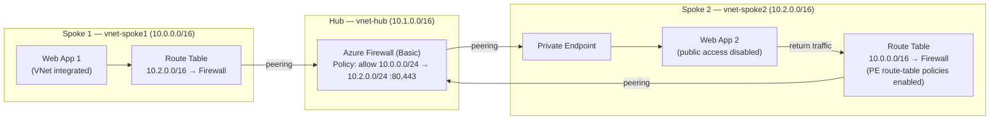

# Hub-Spoke Network with Azure Firewall & Web Apps
Terraform configuration that provisions a hub-and-spoke network topology on Azure. For ease of testing, 2 Web Apps are created (one in each spoke). You can use SSH/Kudu to test traffic. Traffic from Spoke1 to Spoke2 Web Apps is routed through a central Azure Firewall, and the private spoke web app is exposed to the network via a Private Endpoint.

> **Note:** By default Azure injects an implicit `/32` system route for the Private Endpoint IP into every peered VNet, and that more-specific route normally wins — so traffic bypasses any UDR and reaches the Private Endpoint directly. This template enables **route-table network policies** on the PE subnet (`private_endpoint_network_policies = "RouteTableEnabled"`), which lets user-defined routes take precedence over that `/32`. As a result, both the inbound path (Spoke 1 → PE) and the Private Endpoint's return path (PE → Spoke 1) are forced through the Azure Firewall, giving symmetric, inspected routing.

## Architecture


- **Hub VNet** (`10.1.0.0/16`) hosts the Azure Firewall (`AzureFirewallSubnet`) and its management interface (`AzureFirewallManagementSubnet`).
- **Spoke 1 VNet** (`10.0.0.0/16`) hosts a VNet-integrated Linux Web App. All outbound traffic is forced through the VNet, and a route table sends Spoke 2-bound traffic (`10.2.0.0/16`) to the firewall's private IP.
- **Spoke 2 VNet** (`10.2.0.0/16`) hosts a second Linux Web App with public access disabled, reachable only through a Private Endpoint. The PE subnet has route-table network policies enabled and its own route table sending Spoke 1-bound traffic (`10.0.0.0/16`) to the firewall, so the Private Endpoint's return traffic is inspected symmetrically.
- Each spoke is peered bidirectionally with the hub (no spoke-to-spoke peering — cross-spoke traffic transits the firewall).
- A `privatelink.azurewebsites.net` private DNS zone is linked to all three VNets so the Private Endpoint resolves correctly from any network.

## Resources created
| File | Resources |
| --- | --- |
| [main.tf](main.tf) | Provider config, resource group |
| [virtualnetworks.tf](virtualnetworks.tf) | 3 VNets, subnets, and hub↔spoke peerings |
| [firewall.tf](firewall.tf) | Azure Firewall (Basic), policy, network rule collection, public IPs |
| [routetables.tf](routetables.tf) | Spoke 1 and Spoke 2 route tables forcing cross-spoke traffic through the firewall |
| [webapps.tf](webapps.tf) | App Service plan, 2 Linux Web Apps, Private Endpoint, private DNS zone + links |
| [variables.tf](variables.tf) | Input variable definitions and defaults |

## Prerequisites
- Terraform
- Azure CLI logged in via `az login`

## Usage
```bash
# Deployment
terraform init
terraform plan
terraform apply

# (Optional) Delete when done
terraform destroy
```

## Inputs
| Name | Description | Default |
| --- | --- | --- |
| `resource_group_name` | Name of the resource group | `hub-spoke-demo-rg` |
| `location` | Azure region for all resources | `centralus` |
| `vnet_hub` | Name of the hub virtual network | `vnet-hub` |
| `vnet_spoke1` | Name of the spoke 1 virtual network | `vnet-spoke1` |
| `vnet_spoke2` | Name of the spoke 2 virtual network | `vnet-spoke2` |

Override any default by passing `-var`, e.g. `terraform apply -var="location=eastus2"`.

## Notes
- The two web apps share a single **P0v3** Linux App Service plan and run **.NET 10**. Web app names get a random 6-character numeric suffix to keep them globally unique.
- The Azure Firewall uses the **Basic** tier, which requires both a data-plane and a management public IP plus a firewall policy.
- The firewall policy currently allows only TCP `80`/`443` from Spoke 1 (`10.0.0.0/24`) to Spoke 2 (`10.2.0.0/24`). Adjust the rule collection in [firewall.tf](firewall.tf) to change allowed flows.
- The Private Endpoint subnet sets `private_endpoint_network_policies = "RouteTableEnabled"` in [virtualnetworks.tf](virtualnetworks.tf). This is required for the Spoke 2 route table to apply to the Private Endpoint; without it, Azure's implicit `/32` route would send return traffic directly and bypass the firewall, breaking symmetric routing.
