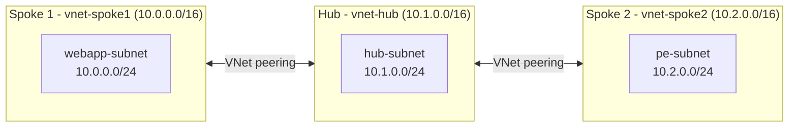

# Simple Hub-Spoke Network

Terraform configuration that provisions a basic hub-and-spoke network topology in Azure. Two spoke virtual networks are each connected to a central hub virtual network through bidirectional VNet peerings.

## Architecture



The peerings allow each spoke to communicate with the hub. Azure VNet peering is not transitive, so this configuration does not provide spoke-to-spoke connectivity. Add a routing appliance, Azure Firewall, or direct spoke peering if that connectivity is required.

## Resources Created

| Resource | Configuration |
| --- | --- |
| Resource group | Contains all resources in the selected Azure region |
| Hub VNet | `10.1.0.0/16` with `hub-subnet` (`10.1.0.0/24`) |
| Spoke 1 VNet | `10.0.0.0/16` with `webapp-subnet` (`10.0.0.0/24`) |
| Spoke 2 VNet | `10.2.0.0/16` with `pe-subnet` (`10.2.0.0/24`) |
| VNet peerings | Bidirectional hub-to-spoke peerings for both spokes |

## Prerequisites

- Terraform 1.1.0 or later
- Azure CLI
- An Azure subscription where you can create resource groups and virtual networks
- An authenticated Azure CLI session (`az login`)

## Usage

From this directory, initialize and review the deployment:

```bash
terraform init
terraform plan
```

Deploy the resources:

```bash
terraform apply
```

To override defaults, use a `.tfvars` file or pass variables directly:

```bash
terraform apply -var="location=eastus2" -var="resource_group_name=my-network-rg"
```

Remove the deployed resources when they are no longer needed:

```bash
terraform destroy
```

## Inputs

| Name | Description | Type | Default |
| --- | --- | --- | --- |
| `resource_group_name` | Name of the resource group | `string` | `simple-hub-spoke-rg` |
| `location` | Azure region for all resources | `string` | `centralus` |
| `vnet_hub` | Name of the hub virtual network | `string` | `vnet-hub` |
| `vnet_spoke1` | Name of the first spoke virtual network | `string` | `vnet-spoke1` |
| `vnet_spoke2` | Name of the second spoke virtual network | `string` | `vnet-spoke2` |

## Files

| File | Purpose |
| --- | --- |
| [main.tf](main.tf) | Terraform and provider requirements, Azure provider, and resource group |
| [variables.tf](variables.tf) | Input variable definitions and defaults |
| [virtualnetworks.tf](virtualnetworks.tf) | VNets, subnets, and bidirectional VNet peerings |

## Notes

- The peerings disable forwarded traffic, gateway transit, and remote gateway usage.
- The template does not deploy network security groups, route tables, gateways, firewalls, workloads, or monitoring.